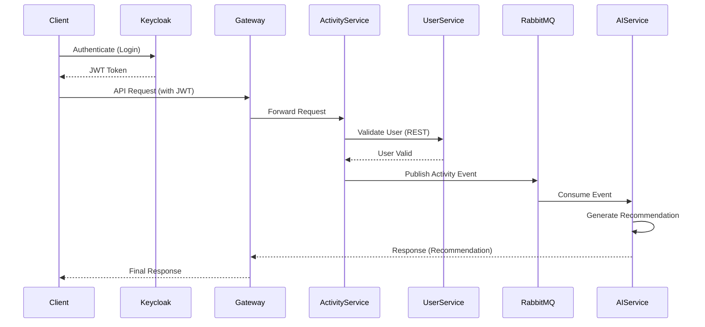

# 🏋️ Fitness App - Microservices Architecture

A scalable **Fitness Tracking Application** built using **Spring Boot Microservices**, **React**, and modern DevOps tools like **Docker**.

---

## 🚀 Overview

This project demonstrates a **real-world microservices architecture** with:

* 🔐 Secure authentication using Keycloak
* 🌐 API Gateway for routing
* 🔎 Service discovery using Eureka
* ⚙️ Centralized configuration using Config Server
* 🔄 Hybrid communication:

  * REST (synchronous)
  * RabbitMQ (asynchronous)

---

## 🧱 Architecture

### 🔁 Flow

1. Client authenticates via **Keycloak**
2. Receives JWT token
3. Requests go through **API Gateway**
4. Services communicate:

   * **Activity Service → User Service (REST)** for validation
   * **Activity Service → RabbitMQ → AI Service** for recommendations

---

## 📷 Architecture Diagram


---

## 🔄 Request Flow (Sequence Diagram)




---

## 🛠️ Tech Stack

### Backend

* Java 17
* Spring Boot
* Spring Cloud (Eureka, Config Server, Gateway)
* RabbitMQ
* MongoDB
* PostgreSQL
* Keycloak

### Frontend

* React.js
* Redux Toolkit

### DevOps

* Docker
* Docker Compose

---

## 🧩 Microservices

| Service              | Description                                 |
| -------------------- | ------------------------------------------- |
| **User Service**     | Manages users (PostgreSQL)                  |
| **Activity Service** | Tracks activities + publishes events        |
| **AI Service**       | Consumes events & generates recommendations |
| **API Gateway**      | Entry point for all requests                |
| **Eureka Server**    | Service discovery                           |
| **Config Server**    | Centralized configuration                   |

---

## 🐳 Run with Docker

### 1️⃣ Build all services

```bash
mvn clean package -DskipTests
```

### 2️⃣ Start system

```bash
docker-compose up --build
```

---

## 🌐 Services

| Service       | URL                    |
| ------------- | ---------------------- |
| API Gateway   | http://localhost:8080  |
| Eureka Server | http://localhost:8761  |
| Keycloak      | http://localhost:8181  |
| RabbitMQ UI   | http://localhost:15672 |
| Config Server | http://localhost:8888  |

---

## 🔐 Environment Variables

Create a `.env` file:

```env
GEMINI_API_URL=your-api-url
GEMINI_API_KEY=your-api-key
POSTGRES_DB=fitnessdb
POSTGRES_USER=postgres
POSTGRES_PASSWORD=password
```

---

## 📦 Project Structure

```
fitness-app/
│
├── backend/
│   ├── activity-service/
│   ├── ai-service/
│   ├── user-service/
│   ├── gateway/
│   ├── eureka-server/
│   ├── config-server/
│
├── frontend/
│   └── fitness-app-frontend/
│
├── docker/
│   └── docker-compose.yml
│
├── docs/
│   ├── architecture.png
│   └── sequence.png
│
└── README.md
```

---

## ⚙️ Key Features

* 🔐 Authentication with Keycloak (JWT-based)
* 🔄 Hybrid communication (REST + Event-driven)
* 📡 Service discovery using Eureka
* ⚙️ Centralized config with Config Server
* 🐳 Fully Dockerized microservices setup

---

## 🧠 System Design Highlights

* **Synchronous Communication**

  * Activity → User Service (validation)

* **Asynchronous Communication**

  * Activity → RabbitMQ → AI Service

* **Scalability**

  * Loosely coupled services
  * Event-driven architecture

---

## 👨‍💻 Author

**Debayan Mondal**

---

## ⭐ Future Improvements

* ☸️ Kubernetes deployment
* 🔄 CI/CD pipeline (GitHub Actions)
* 📊 Monitoring (Prometheus + Grafana)
* 📄 API documentation (Swagger)

---

## 💡 Note

This project is designed to demonstrate **real-world backend architecture**, combining security, scalability, and distributed system design.
